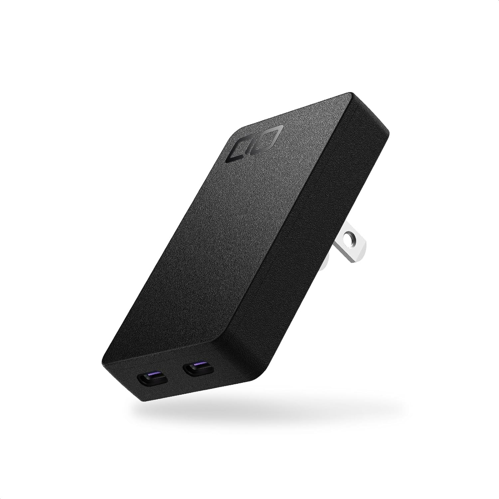
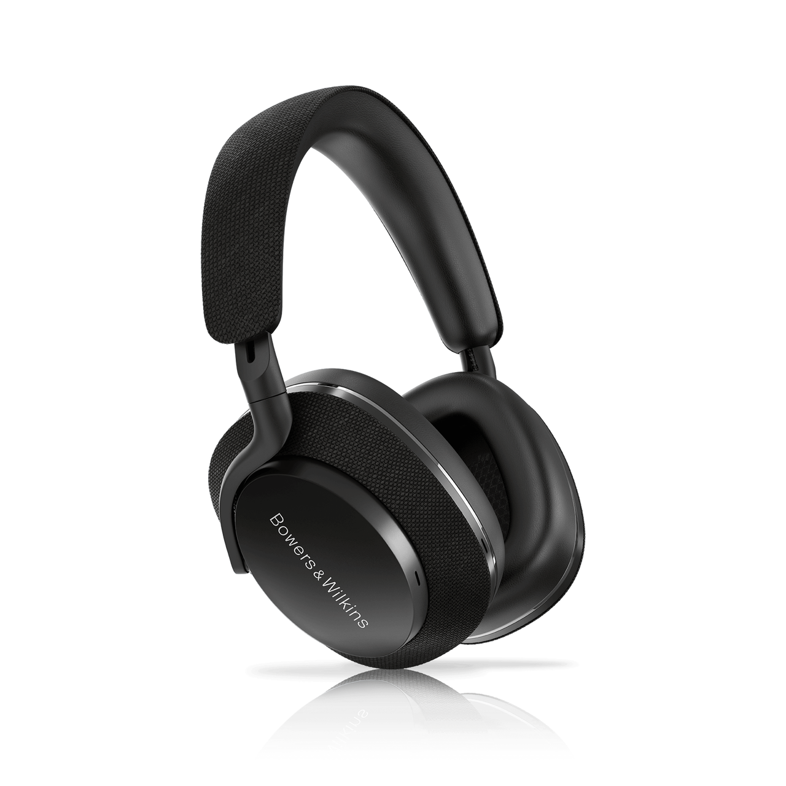
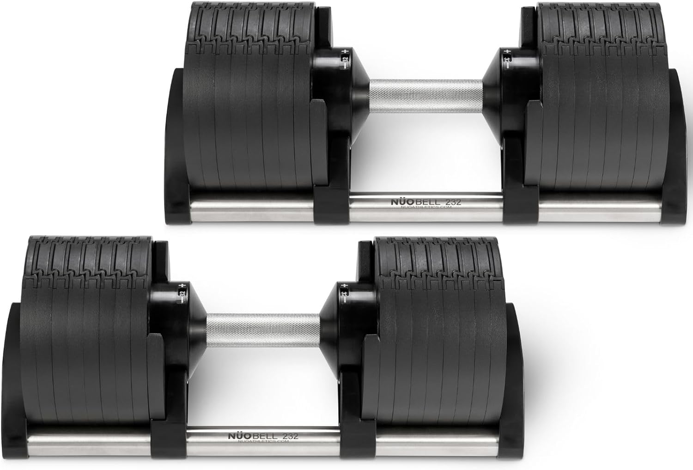

<!--
theme: gaia
class:
 - invert
headingDivider: 2
paginate: true
-->

<!--
_class:
 - lead
 - invert
-->

# フリーランスベストバイデバイス 3 選

2024 年 1Q 編

## 誰お前？

- 氏名: 大杉太郎
- Twitter: @tarosg
- 仕事: エンジニア，プログラミング講師
- 技術: Laravel，JS，Deno，（Rust）
- 好きなもの: 💻，📚，🥃，✈ 🚌 🚃，🚮
- ジーズアカデミーに（たまに）います．

## 生態

- 仕事場が決まっていない．

  - 動ける & 集中できる．

- 健康が大事（重要）．

  - 身体が売上に直結する．

**作業環境と自己管理が問われるッ！**

## 第 3 位

<!--
_class:
 - lead
 - invert
-->

## 薄型 AC 電源（45W）

<!--
_class:
 - lead
 - invert
-->

##

## 持ち物を薄くするデバイス

<!--
_class:
 - lead
 - invert
-->

## 第 3 位 薄型 AC 電源（45W）

**CIO NovaPort SLIM 45W**

- タイプ C が 2 つ．

  - MBA（M2）と iPhone を同時に充電できる．

- 薄い（13mm）．

  - ケーブル含めてもとても収まりが良い．

## 第 2 位

<!--
_class:
 - lead
 - invert
-->

## ノイズキャンセリングヘッドホン

<!--
_class:
 - lead
 - invert
-->

##

## 集中するためのエネルギーを減らすデバイス

<!--
_class:
 - lead
 - invert
-->

## 第 2 位 ノイズキャンセリングヘッドホン

**Bowers & Wilkins Px7S2E**

- ノイキャン

  - 家でも意外とうるさい．エアコン，冷蔵庫，車の走行音など．

- ヘッドホン

  - 耳が物理的に痛まない．

## 第 1 位

<!--
_class:
 - lead
 - invert
-->

## 可変式ダンベル

<!--
_class:
 - lead
 - invert
-->

##

## 毎日筋肉痛になれるデバイス

<!--
_class:
 - lead
 - invert
-->

## 第 1 位 可変式ダンベル

**FLEXBELL 32kg 2kg 刻み**

- 重さを変えられる．

  - 体力に合わせて調整できる．

  - 場所を取らない．

- バーベルよりも不安定．

  - 左右差に気づける．

  - 体幹を鍛えられる．

## 第 1 位 可変式ダンベル

- 10kg くらいのダンベルは物足りなくなる．

- 高いダンベルのほうがもとを取ろうとして頻繁に使う．

## まとめ

**フリーランスは環境と身体に気を配ろう！**

- 第 3 位：CIO NovaPort SLIM 45W

- 第 2 位：Bowers & Wilkins Px7S2E

- 第 1 位：FLEXBELL 32kg 2kg 刻み

# 🥃

<!--
_class:
 - lead
 - invert
-->

### Thanks!

